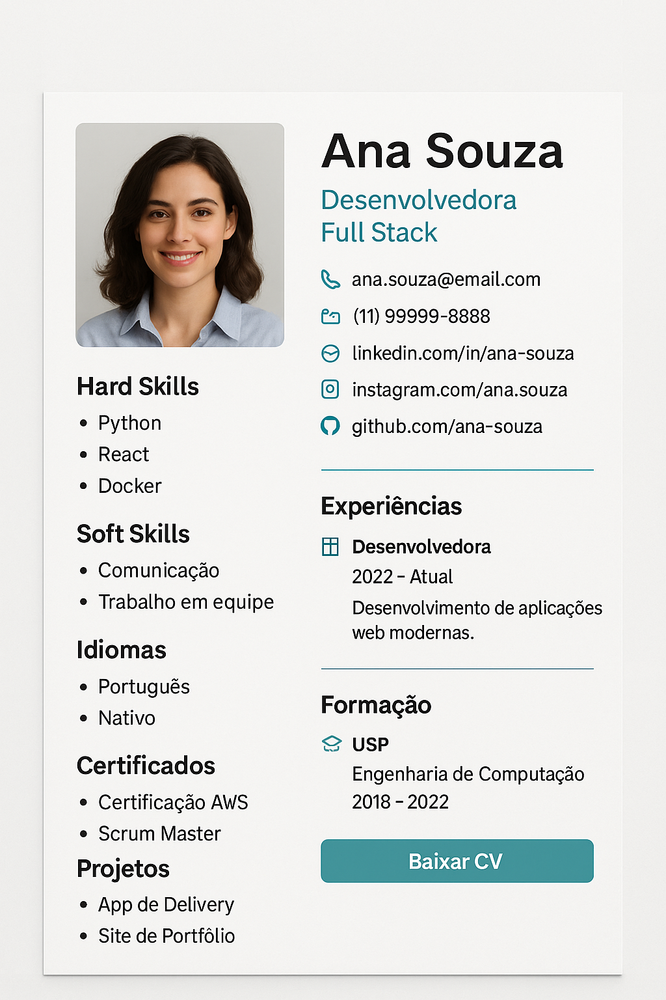

# 🧠 Gerador de Currículo IA - Chatbot + Preview + PDF + Python

Crie currículos profissionais em **segundos**, de forma divertida, intuitiva e acessível!
O usuário escolhe entre:

* ✅ **Via Web (Chatbot no navegador)**
* ✅ **Via Python (Terminal interativo)**

O processo é o mesmo: você responde perguntas, vê uma **preview fiel ao modelo profissional** e pode baixar seu PDF com design responsivo.

---

## 🚀 Funcionalidades

* 🤖 Chatbot interativo no navegador
* 🐍 Script Python interativo no terminal
* 📄 Preview do currículo **100% igual ao modelo original (preview\.html)**
* 🖼️ Design profissional, responsivo e elegante
* 📥 Download do currículo em PDF diretamente no navegador ou no terminal (via Python)
* 🌐 **Rodando na Web (GitHub Pages)** ou **localmente via Python**

---

## 📸 Preview Visual

| 💬 Chatbot Web                        | 📄 Preview do Currículo                      |
| ------------------------------------- | -------------------------------------------- |
|  |  |

---

## 🏗️ Tecnologias Usadas

* HTML5 + CSS3 (W3.CSS)
* JavaScript puro
* Python + Playwright (para gerar PDF localmente)
* html2pdf.js (para gerar PDF via navegador)
* LocalStorage (armazenamento no navegador)
* Hospedagem no **GitHub Pages**

---

## 📂 Estrutura do Projeto

```bash
/web
|-- index.html         # Chatbot Web
|-- preview.html       # Preview fiel ao modelo (Currículo)
|-- css/
|   |-- style.css      # Estilos do projeto
|-- js/
|   |-- script.js      # Lógica do Chatbot e PDF
|-- assets/            # Imagens, avatar, logos
|-- api-python/        # Versão em Python
|   |-- atualizar_curriculo.py
|-- README.md
```

---

## 🛠️ Como Rodar

### 🔗 **Via Web (GitHub Pages)**

1. Clone ou faça fork do repositório:

```bash
git clone https://github.com/seu-usuario/gerador-curriculo-ia.git
```

2. Entre na pasta `/web`
3. No GitHub, ative o **GitHub Pages** na branch principal, pasta `/web`
4. Acesse o link gerado:

```
https://seu-usuario.github.io/gerador-curriculo-ia/web/
```

5. Pronto! 🎉

### 🐍 **Via Python (Local)**

### 🚩 Dependências necessárias:

* Python 3.x instalado
* Dependências Python:

```bash
pip install playwright instaloader requests
```

* Inicialize o Playwright:

```bash
playwright install
```

### 🚀 Executando:

1. Navegue até a pasta `api-python`

```bash
cd api-python
```

2. Execute o script:

```bash
python atualizar_curriculo.py
```

3. Responda às perguntas no terminal (nome, cargo, email, telefone, foto, experiências, formações, habilidades)
4. O script gera automaticamente `preview.html` e `curriculo.pdf`
5. Você pode abrir o `preview.html` no navegador para ver exatamente como ficará o PDF, e o PDF estará salvo localmente.

---

## 💾 Como Usar

✔️ Escolha sua opção:

* **Via Web:**

  1. Acesse o Chatbot (`index.html`)
  2. Responda as perguntas (nome, cargo, experiências, formação, habilidades...)
  3. Veja a **Preview** (abre em `preview.html`) **idêntica ao modelo**
  4. Clique em **"Baixar PDF"** para gerar seu currículo com o layout profissional

* **Via Python:**

  1. Rode o script `atualizar_curriculo.py` (na pasta `/api-python`)
  2. Responda as perguntas no terminal
  3. O script gera automaticamente `preview.html` e `curriculo.pdf`
  4. Abra o preview no navegador e/ou baixe seu PDF prontinho

---

## 🔥 Features Extras Planejadas

* Integração via WhatsApp
* Integração via Telegram
* API em Flask ou Node.js

---

## 🌟 Desenvolvido por

**Manoel Coelho**
[GitHub](https://github.com/eusoumanoelnetto) | [LinkedIn](https://www.linkedin.com/in/eusoumanoelnetto) | [Instagram](https://www.instagram.com/eusoumanoelnetto)

> "Manoel Coelho idealizou, Copilot e ChatGPT ajudaram a dar vida."

---

## 📄 Licença

[MIT](./LICENSE)

---

## 🚀 Deploy Link

**Acesse Aqui:**

```bash
https://eusoumanoelnetto.github.io/gerador-curriculo-ia/web/
```
